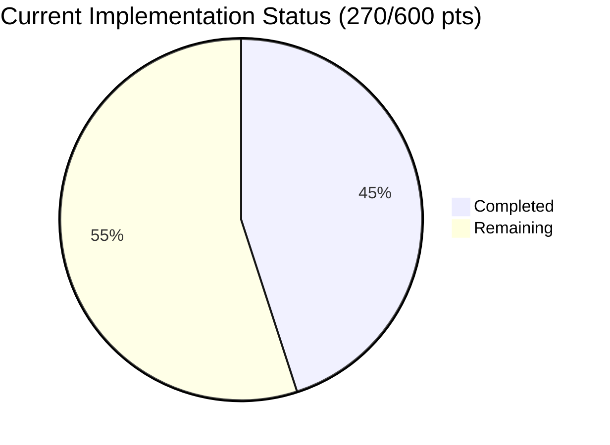
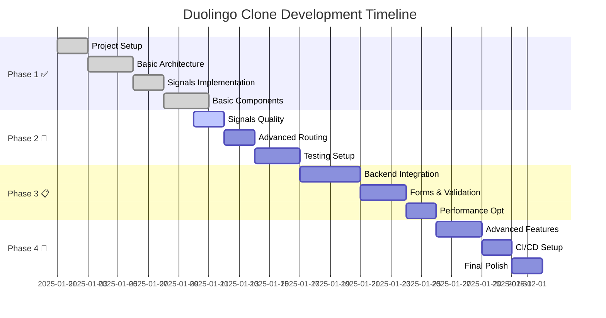

# Duolingo Clone - Architecture Diagrams

## System Architecture

```mermaid
graph TD
    A[Duolingo Clone - Angular 19] --> B[Core Architecture]
    A --> C[Features]
    A --> D[Infrastructure]

    B --> B1[Signals Store]
    B --> B2[Routing]
    B --> B3[Models]
    
    B1 --> B1a[LessonService - Single Source of Truth]
    B1 --> B1b[Computed: completedLessons, totalXP, streak]
    B1 --> B1c[Effects: localStorage, analytics]
    
    B2 --> B2a[Lazy Loading Components]
    B2 --> B2b[404 Error Handling]
    B2 --> B2c[Guards & Resolvers - TODO]
    
    B3 --> B3a[User Model]
    B3 --> B3b[Lesson Model]
    B3 --> B3c[TypeScript Strict]

    C --> C1[Lessons Feature]
    C --> C2[Profile Feature]
    C --> C3[Auth Feature - TODO]
    
    C1 --> C1a[LessonsComponent - @for, @if]
    C1 --> C1b[LessonDetailComponent - @switch]
    C1 --> C1c[Quiz Logic with Signals]
    
    C2 --> C2a[ProfileComponent]
    C2 --> C2b[User Stats Display]

    D --> D1[Testing - TODO]
    D --> D2[Backend - TODO]
    D --> D3[CI/CD - TODO]
    
    D1 --> D1a[Unit Tests]
    D1 --> D1b[E2E Tests]
    D1 --> D1c[Component Harness]
    
    D2 --> D2a[Firebase Integration]
    D2 --> D2b[HTTP Interceptors]
    D2 --> D2c[Realtime Updates]

    style A fill:#58cc02,stroke:#333,stroke-width:3px,color:#fff
    style B1a fill:#e8f5e8,stroke:#58cc02
    style C1a fill:#e8f5e8,stroke:#58cc02
    style C1b fill:#e8f5e8,stroke:#58cc02
    style D1 fill:#ffebee,stroke:#f44336
    style D2 fill:#ffebee,stroke:#f44336
    style D3 fill:#ffebee,stroke:#f44336
```

## Implementation Progress

```mermaid
pie title Current Implementation Status (270/600 pts)
    "Completed" : 270
    "Remaining" : 330
```

## Development Timeline

```mermaid
gantt
    title Duolingo Clone Development Timeline
    dateFormat  YYYY-MM-DD
    section Phase 1 ✅
    Project Setup           :done, setup, 2025-01-01, 2d
    Basic Architecture      :done, arch, after setup, 3d
    Signals Implementation  :done, signals, after arch, 2d
    Basic Components        :done, comp, after signals, 3d
    
    section Phase 2 🔄
    Signals Quality         :active, sq, 2025-01-10, 2d
    Advanced Routing        :ar, after sq, 2d
    Testing Setup           :test, after ar, 3d
    
    section Phase 3 📋
    Backend Integration     :backend, after test, 4d
    Forms & Validation      :forms, after backend, 3d
    Performance Opt         :perf, after forms, 2d
    
    section Phase 4 🚀
    Advanced Features       :adv, after perf, 3d
    CI/CD Setup            :ci, after adv, 2d
    Final Polish           :polish, after ci, 2d
```