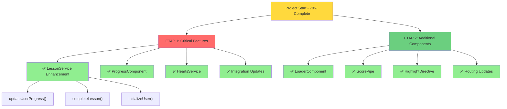

# Development Phases Completed

```mermaid
graph TD
    A["Project Start - 70% Complete"] --> B["ETAP 1: Critical Features"]
    A --> C["ETAP 2: Additional Components"]
    
    B --> B1["✅ LessonService Enhancement"]
    B --> B2["✅ ProgressComponent"]
    B --> B3["✅ HeartsService"]
    B --> B4["✅ Integration Updates"]
    
    C --> C1["✅ LoaderComponent"]
    C --> C2["✅ ScorePipe"]
    C --> C3["✅ HighlightDirective"]
    C --> C4["✅ Routing Updates"]
    
    B1 --> B1a["updateUserProgress()"]
    B1 --> B1b["completeLesson()"]
    B1 --> B1c["initializeUser()"]
    
    style A fill:#ffd93d
    style B fill:#ff6b6b
    style C fill:#6bcf7f
    style B1 fill:#90EE90
    style B2 fill:#90EE90
    style B3 fill:#90EE90
    style B4 fill:#90EE90
    style C1 fill:#90EE90
    style C2 fill:#90EE90
    style C3 fill:#90EE90
    style C4 fill:#90EE90
```