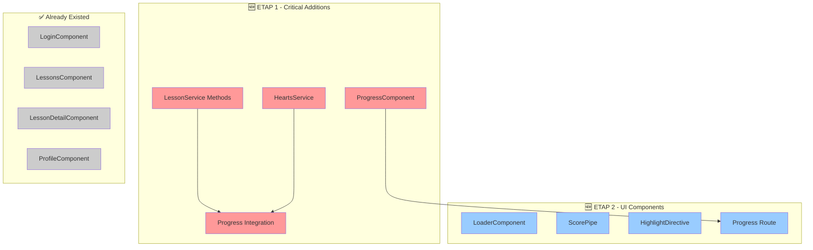

# New Project Structure

```mermaid
graph TB
    subgraph "🆕 ETAP 1 - Critical Additions"
        A1["LessonService Methods"]
        A2["ProgressComponent"]
        A3["HeartsService"]
        A4["Progress Integration"]
    end
    
    subgraph "🆕 ETAP 2 - UI Components"
        B1["LoaderComponent"]
        B2["ScorePipe"]
        B3["HighlightDirective"]
        B4["Progress Route"]
    end
    
    subgraph "✅ Already Existed"
        C1["LoginComponent"]
        C2["LessonsComponent"]
        C3["LessonDetailComponent"]
        C4["ProfileComponent"]
    end
    
    A1 --> A4
    A3 --> A4
    A2 --> B4
    
    style A1 fill:#ff9999
    style A2 fill:#ff9999
    style A3 fill:#ff9999
    style A4 fill:#ff9999
    style B1 fill:#99ccff
    style B2 fill:#99ccff
    style B3 fill:#99ccff
    style B4 fill:#99ccff
    style C1 fill:#cccccc
    style C2 fill:#cccccc
    style C3 fill:#cccccc
    style C4 fill:#cccccc
```