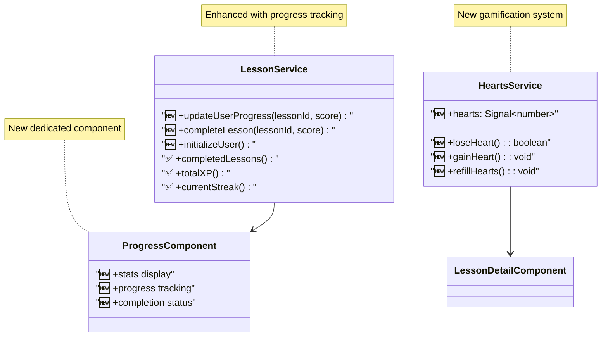

# Services Architecture Enhancement

```mermaid
classDiagram
    class LessonService {
        "🆕 +updateUserProgress(lessonId, score)"
        "🆕 +completeLesson(lessonId, score)"
        "🆕 +initializeUser()"
        "✅ +completedLessons()"
        "✅ +totalXP()"
        "✅ +currentStreak()"
    }
    
    class HeartsService {
        "🆕 +hearts: Signal~number~"
        "🆕 +loseHeart(): boolean"
        "🆕 +gainHeart(): void"
        "🆕 +refillHearts(): void"
    }
    
    class ProgressComponent {
        "🆕 +stats display"
        "🆕 +progress tracking"
        "🆕 +completion status"
    }
    
    LessonService --> ProgressComponent
    HeartsService --> LessonDetailComponent
    
    note for LessonService "Enhanced with progress tracking"
    note for HeartsService "New gamification system"
    note for ProgressComponent "New dedicated component"
```