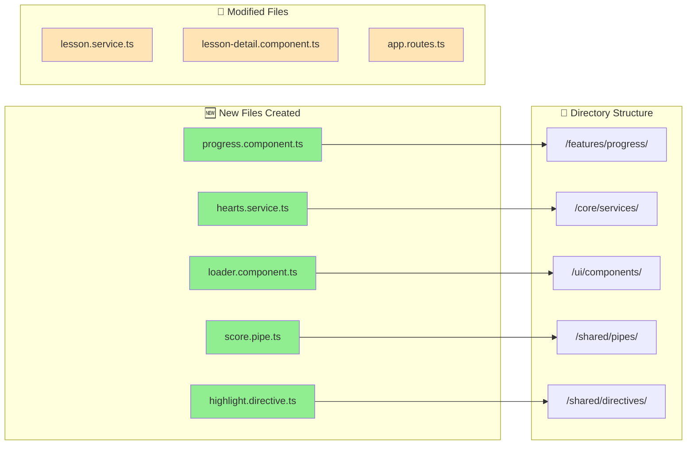

# File System Changes

```mermaid
graph LR
    subgraph "🆕 New Files Created"
        A["progress.component.ts"]
        B["hearts.service.ts"]
        C["loader.component.ts"]
        D["score.pipe.ts"]
        E["highlight.directive.ts"]
    end
    
    subgraph "🔧 Modified Files"
        F["lesson.service.ts"]
        G["lesson-detail.component.ts"]
        H["app.routes.ts"]
    end
    
    subgraph "📁 Directory Structure"
        I["/features/progress/"]
        J["/core/services/"]
        K["/ui/components/"]
        L["/shared/pipes/"]
        M["/shared/directives/"]
    end
    
    A --> I
    B --> J
    C --> K
    D --> L
    E --> M
    
    style A fill:#90EE90
    style B fill:#90EE90
    style C fill:#90EE90
    style D fill:#90EE90
    style E fill:#90EE90
    style F fill:#FFE4B5
    style G fill:#FFE4B5
    style H fill:#FFE4B5
```