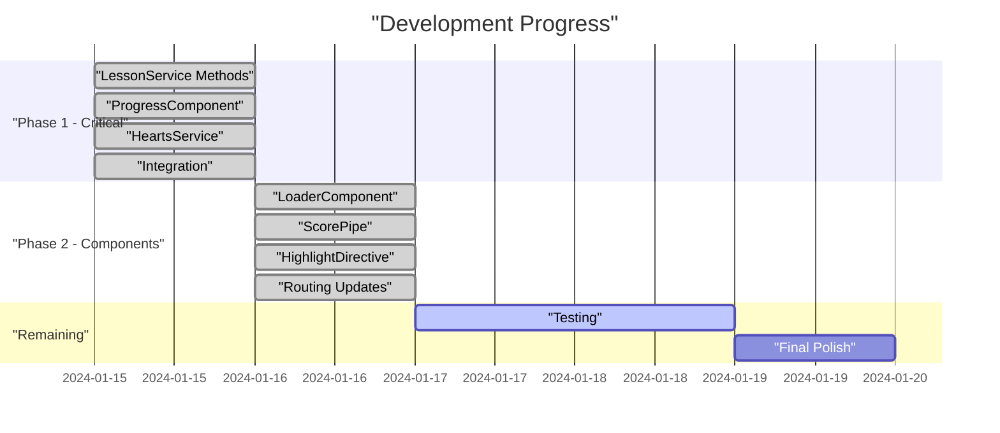

# Implementation Timeline

```mermaid
gantt
    title "Development Progress"
    dateFormat  YYYY-MM-DD
    section "Phase 1 - Critical"
    "LessonService Methods"    :done, 2024-01-15, 1d
    "ProgressComponent"       :done, 2024-01-15, 1d
    "HeartsService"          :done, 2024-01-15, 1d
    "Integration"            :done, 2024-01-15, 1d
    
    section "Phase 2 - Components"
    "LoaderComponent"        :done, 2024-01-16, 1d
    "ScorePipe"             :done, 2024-01-16, 1d
    "HighlightDirective"    :done, 2024-01-16, 1d
    "Routing Updates"       :done, 2024-01-16, 1d
    
    section "Remaining"
    "Testing"               :active, 2024-01-17, 2d
    "Final Polish"          :2024-01-19, 1d
```