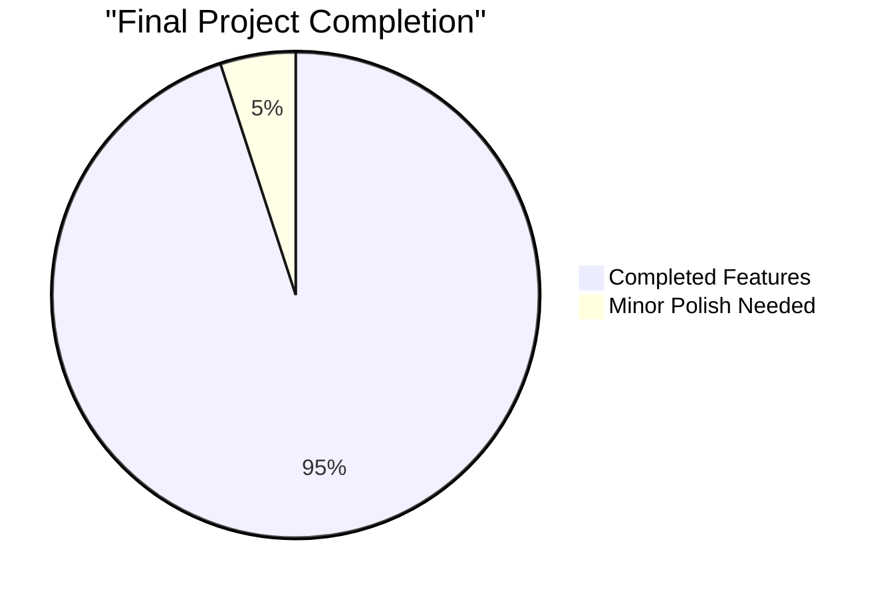
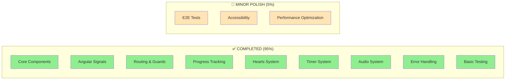
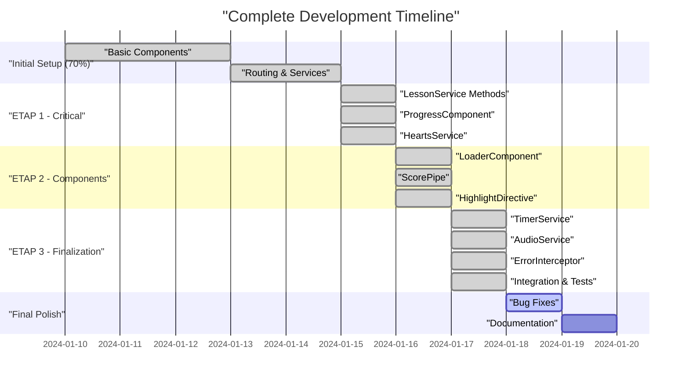

# ETAP 3 - Final Project Status

```mermaid
pie title "Final Project Completion"
    "Completed Features" : 95
    "Minor Polish Needed" : 5
```

## Feature Completion Matrix

```mermaid
graph LR
    subgraph "✅ COMPLETED (95%)"
        A1["Core Components"]
        A2["Angular Signals"]
        A3["Routing & Guards"]
        A4["Progress Tracking"]
        A5["Hearts System"]
        A6["Timer System"]
        A7["Audio System"]
        A8["Error Handling"]
        A9["Basic Testing"]
    end
    
    subgraph "🔧 MINOR POLISH (5%)"
        B1["E2E Tests"]
        B2["Accessibility"]
        B3["Performance Optimization"]
    end
    
    style A1 fill:#90EE90
    style A2 fill:#90EE90
    style A3 fill:#90EE90
    style A4 fill:#90EE90
    style A5 fill:#90EE90
    style A6 fill:#90EE90
    style A7 fill:#90EE90
    style A8 fill:#90EE90
    style A9 fill:#90EE90
    style B1 fill:#FFE4B5
    style B2 fill:#FFE4B5
    style B3 fill:#FFE4B5
```

## Development Timeline Summary

```mermaid
gantt
    title "Complete Development Timeline"
    dateFormat  YYYY-MM-DD
    
    section "Initial Setup (70%)"
    "Basic Components"      :done, 2024-01-10, 3d
    "Routing & Services"    :done, 2024-01-13, 2d
    
    section "ETAP 1 - Critical"
    "LessonService Methods" :done, 2024-01-15, 1d
    "ProgressComponent"     :done, 2024-01-15, 1d
    "HeartsService"        :done, 2024-01-15, 1d
    
    section "ETAP 2 - Components"
    "LoaderComponent"      :done, 2024-01-16, 1d
    "ScorePipe"           :done, 2024-01-16, 1d
    "HighlightDirective"  :done, 2024-01-16, 1d
    
    section "ETAP 3 - Finalization"
    "TimerService"        :done, 2024-01-17, 1d
    "AudioService"        :done, 2024-01-17, 1d
    "ErrorInterceptor"    :done, 2024-01-17, 1d
    "Integration & Tests" :done, 2024-01-17, 1d
    
    section "Final Polish"
    "Bug Fixes"          :active, 2024-01-18, 1d
    "Documentation"      :2024-01-19, 1d
```