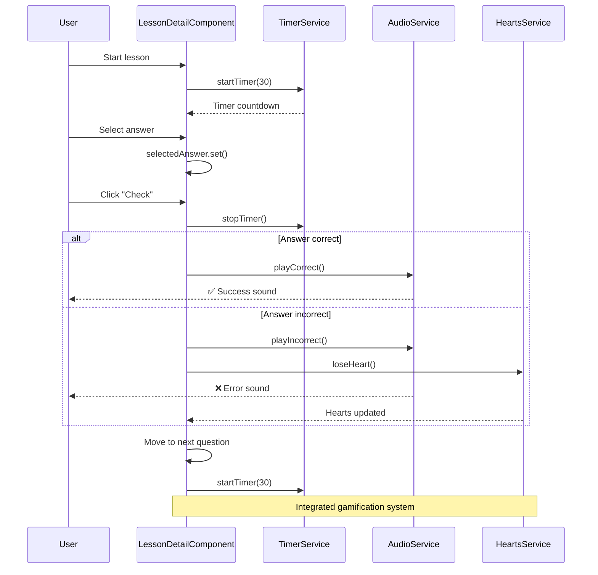

# ETAP 3 - Component Integration Flow

```mermaid
sequenceDiagram
    participant U as User
    participant LC as LessonDetailComponent
    participant TS as TimerService
    participant AS as AudioService
    participant HS as HeartsService
    
    U->>LC: Start lesson
    LC->>TS: startTimer(30)
    TS-->>LC: Timer countdown
    
    U->>LC: Select answer
    LC->>LC: selectedAnswer.set()
    
    U->>LC: Click "Check"
    LC->>TS: stopTimer()
    
    alt Answer correct
        LC->>AS: playCorrect()
        AS-->>U: ✅ Success sound
    else Answer incorrect
        LC->>AS: playIncorrect()
        LC->>HS: loseHeart()
        AS-->>U: ❌ Error sound
        HS-->>LC: Hearts updated
    end
    
    LC->>LC: Move to next question
    LC->>TS: startTimer(30)
    
    Note over LC,HS: Integrated gamification system
```