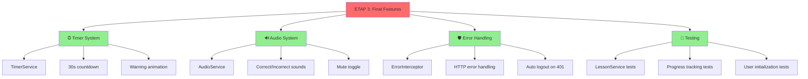

# ETAP 3 - Finalizacja Projektu

```mermaid
graph TD
    A["ETAP 3: Final Features"] --> B["⏰ Timer System"]
    A --> C["🔊 Audio System"]
    A --> D["🛡️ Error Handling"]
    A --> E["🧪 Testing"]
    
    B --> B1["TimerService"]
    B --> B2["30s countdown"]
    B --> B3["Warning animation"]
    
    C --> C1["AudioService"]
    C --> C2["Correct/Incorrect sounds"]
    C --> C3["Mute toggle"]
    
    D --> D1["ErrorInterceptor"]
    D --> D2["HTTP error handling"]
    D --> D3["Auto logout on 401"]
    
    E --> E1["LessonService tests"]
    E --> E2["Progress tracking tests"]
    E --> E3["User initialization tests"]
    
    style A fill:#ff6b6b
    style B fill:#90EE90
    style C fill:#90EE90
    style D fill:#90EE90
    style E fill:#90EE90
```