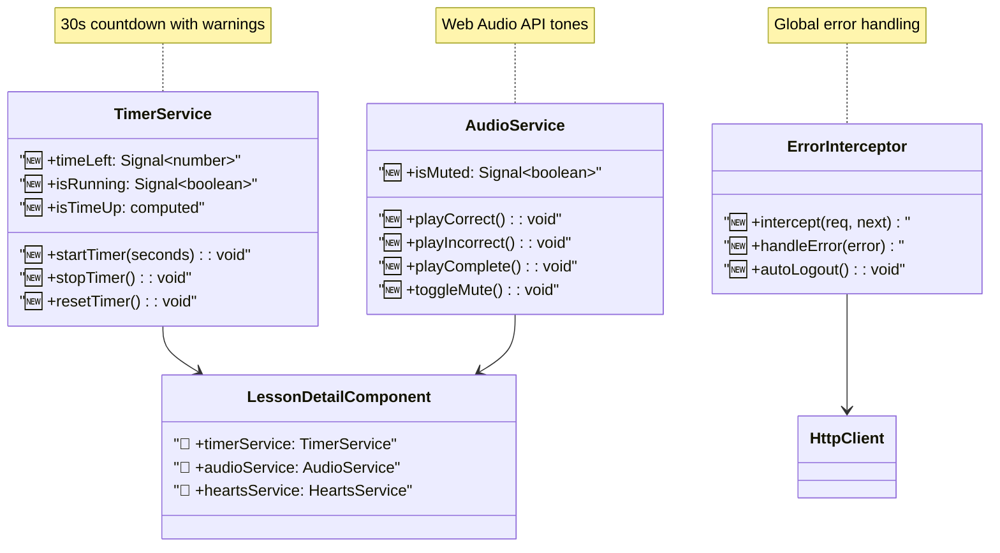

# ETAP 3 - New Services Architecture

```mermaid
classDiagram
    class TimerService {
        "🆕 +timeLeft: Signal~number~"
        "🆕 +isRunning: Signal~boolean~"
        "🆕 +isTimeUp: computed"
        "🆕 +startTimer(seconds): void"
        "🆕 +stopTimer(): void"
        "🆕 +resetTimer(): void"
    }
    
    class AudioService {
        "🆕 +isMuted: Signal~boolean~"
        "🆕 +playCorrect(): void"
        "🆕 +playIncorrect(): void"
        "🆕 +playComplete(): void"
        "🆕 +toggleMute(): void"
    }
    
    class ErrorInterceptor {
        "🆕 +intercept(req, next)"
        "🆕 +handleError(error)"
        "🆕 +autoLogout(): void"
    }
    
    class LessonDetailComponent {
        "🔧 +timerService: TimerService"
        "🔧 +audioService: AudioService"
        "🔧 +heartsService: HeartsService"
    }
    
    TimerService --> LessonDetailComponent
    AudioService --> LessonDetailComponent
    ErrorInterceptor --> HttpClient
    
    note for TimerService "30s countdown with warnings"
    note for AudioService "Web Audio API tones"
    note for ErrorInterceptor "Global error handling"
```