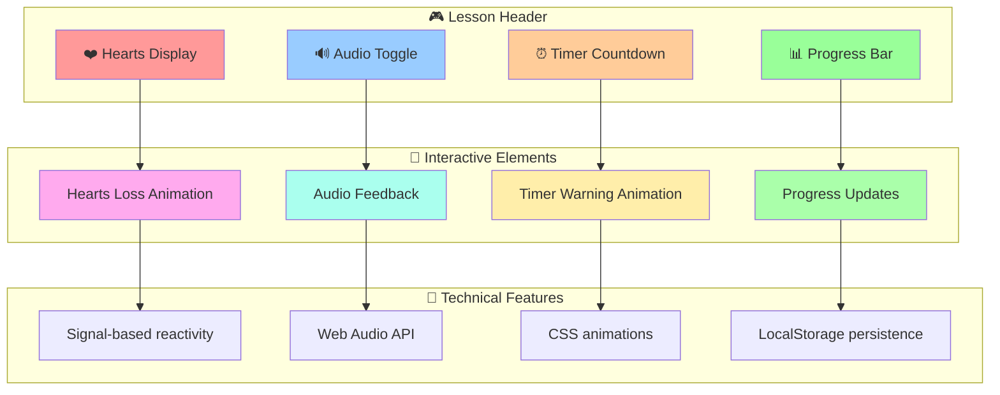

# ETAP 3 - UI Features Enhancement

```mermaid
graph TB
    subgraph "🎮 Lesson Header"
        A1["❤️ Hearts Display"]
        A2["⏰ Timer Countdown"]
        A3["🔊 Audio Toggle"]
        A4["📊 Progress Bar"]
    end
    
    subgraph "🎯 Interactive Elements"
        B1["Timer Warning Animation"]
        B2["Audio Feedback"]
        B3["Hearts Loss Animation"]
        B4["Progress Updates"]
    end
    
    subgraph "🔧 Technical Features"
        C1["Signal-based reactivity"]
        C2["Web Audio API"]
        C3["CSS animations"]
        C4["LocalStorage persistence"]
    end
    
    A1 --> B3
    A2 --> B1
    A3 --> B2
    A4 --> B4
    
    B1 --> C3
    B2 --> C2
    B3 --> C1
    B4 --> C4
    
    style A1 fill:#ff9999
    style A2 fill:#ffcc99
    style A3 fill:#99ccff
    style A4 fill:#99ff99
    style B1 fill:#ffeeaa
    style B2 fill:#aaffee
    style B3 fill:#ffaaee
    style B4 fill:#aaffaa
```