# Feature Structure

## Feature-Sliced Design

```mermaid
graph TD
    A[src/app] --> B[core/]
    A --> C[shared/]
    A --> D[features/]
    A --> E[ui/]
    
    B --> B1[services/]
    B --> B2[guards/]
    B --> B3[interceptors/]
    
    B1 --> B1a[lesson.service.ts ✅]
    B2 --> B2a[auth.guard.ts ❌]
    B3 --> B3a[http.interceptor.ts ❌]
    
    C --> C1[models/]
    C --> C2[components/]
    C --> C3[pipes/]
    C --> C4[directives/]
    
    C1 --> C1a[user.model.ts ✅]
    C1 --> C1b[lesson.model.ts ✅]
    C2 --> C2a[not-found.component.ts ✅]
    C3 --> C3a[custom.pipe.ts ❌]
    C4 --> C4a[custom.directive.ts ❌]
    
    D --> D1[auth/]
    D --> D2[lessons/]
    D --> D3[profile/]
    D --> D4[progress/]
    
    D1 --> D1a[login.component.ts ❌]
    D2 --> D2a[lessons.component.ts ✅]
    D2 --> D2b[lesson-detail.component.ts ✅]
    D3 --> D3a[profile.component.ts ✅]
    D4 --> D4a[progress.component.ts ❌]
    
    E --> E1[components/]
    E1 --> E1a[button.component.ts ❌]
    E1 --> E1b[card.component.ts ❌]
    
    style B1a fill:#e8f5e8
    style C1a fill:#e8f5e8
    style C1b fill:#e8f5e8
    style C2a fill:#e8f5e8
    style D2a fill:#e8f5e8
    style D2b fill:#e8f5e8
    style D3a fill:#e8f5e8
```



## Routing Structure

```mermaid
graph LR
    A[/] --> B[redirect to /lessons]
    C[/lessons] --> D[LessonsComponent - Lazy]
    E[/lesson/:id] --> F[LessonDetailComponent - Lazy]
    G[/profile] --> H[ProfileComponent - Lazy]
    I[/**] --> J[NotFoundComponent - Lazy]
    
    style D fill:#e8f5e8
    style F fill:#e8f5e8
    style H fill:#e8f5e8
    style J fill:#e8f5e8
```