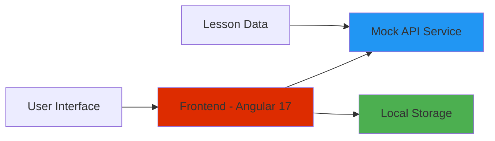
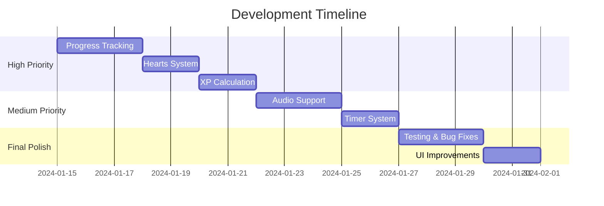

# Midterm Demo - Duolingo Clone

## 1. Introduction (1-2 min)

### Team & Project Overview
- **Project**: Duolingo Clone - Language Learning Application
- **Goal**: Create interactive language learning platform with lessons, progress tracking, and gamification
- **Why needed**: Demonstrate modern Angular development with Signals, standalone components, and advanced routing

### Architecture Overview

## 2. Live Demo (5-6 min)

### What We'll Show:
1. **Login Flow** - Mock authentication
2. **Lessons List** - Available lessons with progress
3. **Lesson Detail** - Interactive questions (multiple choice & fill-in-blank)
4. **Profile Page** - User statistics and progress
5. **Navigation** - Routing with guards and preloading

### Key Features Demonstrated:
- ✅ **Angular Signals** - Reactive state management
- ✅ **Standalone Components** - Modern Angular architecture
- ✅ **Lazy Loading** - Performance optimization
- ✅ **Route Guards** - Authentication protection
- ✅ **Custom Preloading** - Smart resource loading

## 3. Technical Highlights (1 min)

### What's Working:
- **Core Navigation** - Login → Lessons → Lesson Detail → Profile
- **Interactive Questions** - Two question types implemented
- **Progress Tracking** - Basic XP and completion stats
- **Responsive Design** - Mobile-friendly interface
- **Modern Angular** - Signals, standalone components, new control flow

## 4. Current Challenges (1 min)

### Main Difficulties:
1. **Button Functionality** - Check button event handling (recently fixed)
2. **State Management** - Complex lesson progress synchronization
3. **Data Persistence** - Implementing proper progress saving
4. **Signal Integration** - Learning curve with new Angular features

## 5. Next Steps (1 min)

### Remaining Tasks:

### Priority Focus:
- **Week 1**: Complete progress tracking and hearts system
- **Week 2**: Add audio support and timer functionality
- **Week 3**: Testing, bug fixes, and final polish

---

## Demo Script Notes:

### Opening (30 sec)
"Hi, I'm presenting our Duolingo Clone project. We're building a language learning app using Angular 17 with the latest features like Signals and standalone components."

### Architecture (30 sec)
"Our architecture is straightforward - Angular frontend with mock API services and local storage for data persistence. We've focused on modern Angular patterns."

### Live Demo (5 min)
1. **Start at login** - "Here's our authentication flow"
2. **Show lessons list** - "Users can see available lessons with progress indicators"
3. **Enter lesson** - "Interactive questions with immediate feedback"
4. **Navigate to profile** - "Progress tracking with XP and statistics"
5. **Highlight routing** - "Notice the smooth navigation and URL changes"

### Wrap-up (1 min)
"We've completed 70% of core functionality. Main challenges were state management and Angular Signals integration. Next focus: progress persistence and gamification features."

## Technical Demo Points:
- Show browser dev tools briefly to highlight Signals in action
- Demonstrate responsive design by resizing window
- Show route protection by trying to access lesson without login
- Highlight the preloading strategy in network tab