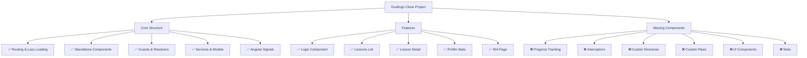
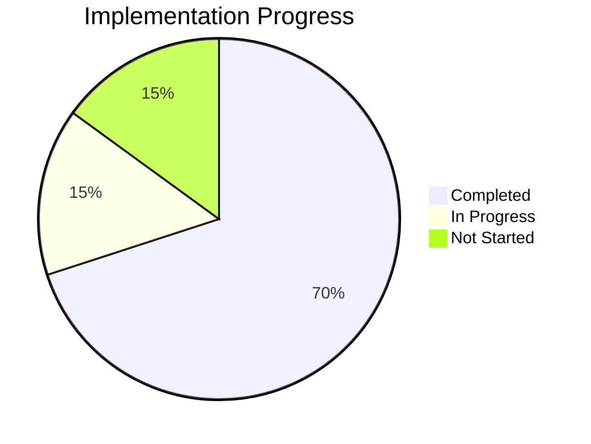
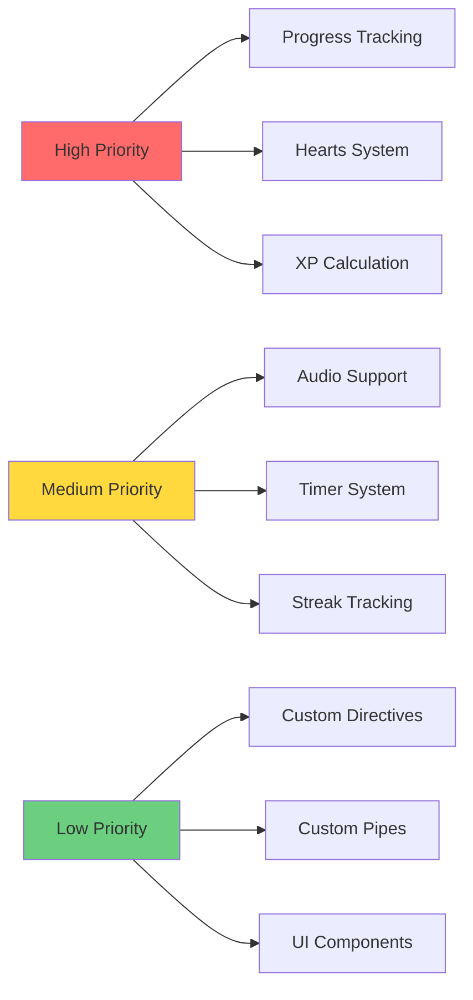
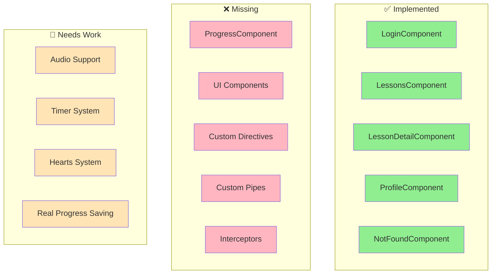

# Project Status Overview

## Implementation Progress

```mermaid
graph TD
    A[Duolingo Clone Project] --> B[Core Structure]
    A --> C[Features]
    A --> D[Missing Components]
    
    B --> B1[✅ Routing & Lazy Loading]
    B --> B2[✅ Standalone Components]
    B --> B3[✅ Guards & Resolvers]
    B --> B4[✅ Services & Models]
    B --> B5[✅ Angular Signals]
    
    C --> C1[✅ Login Component]
    C --> C2[✅ Lessons List]
    C --> C3[✅ Lesson Detail]
    C --> C4[✅ Profile Stats]
    C --> C5[✅ 404 Page]
    
    D --> D1[❌ Progress Tracking]
    D --> D2[❌ Interceptors]
    D --> D3[❌ Custom Directives]
    D --> D4[❌ Custom Pipes]
    D --> D5[❌ UI Components]
    D --> D6[❌ Tests]
```

## Feature Completion Status

```mermaid
pie title Implementation Progress
    "Completed" : 70
    "In Progress" : 15
    "Not Started" : 15
```

## Priority Tasks

```mermaid
flowchart LR
    A[High Priority] --> A1[Progress Tracking]
    A --> A2[Hearts System]
    A --> A3[XP Calculation]
    
    B[Medium Priority] --> B1[Audio Support]
    B --> B2[Timer System]
    B --> B3[Streak Tracking]
    
    C[Low Priority] --> C1[Custom Directives]
    C --> C2[Custom Pipes]
    C --> C3[UI Components]
    
    style A fill:#ff6b6b
    style B fill:#ffd93d
    style C fill:#6bcf7f
```

## Component Architecture Status

```mermaid
graph TB
    subgraph "✅ Implemented"
        A1[LoginComponent]
        A2[LessonsComponent]
        A3[LessonDetailComponent]
        A4[ProfileComponent]
        A5[NotFoundComponent]
    end
    
    subgraph "❌ Missing"
        B1[ProgressComponent]
        B2[UI Components]
        B3[Custom Directives]
        B4[Custom Pipes]
        B5[Interceptors]
    end
    
    subgraph "🔧 Needs Work"
        C1[Audio Support]
        C2[Timer System]
        C3[Hearts System]
        C4[Real Progress Saving]
    end
    
    style A1 fill:#90EE90
    style A2 fill:#90EE90
    style A3 fill:#90EE90
    style A4 fill:#90EE90
    style A5 fill:#90EE90
    
    style B1 fill:#FFB6C1
    style B2 fill:#FFB6C1
    style B3 fill:#FFB6C1
    style B4 fill:#FFB6C1
    style B5 fill:#FFB6C1
    
    style C1 fill:#FFE4B5
    style C2 fill:#FFE4B5
    style C3 fill:#FFE4B5
    style C4 fill:#FFE4B5
```