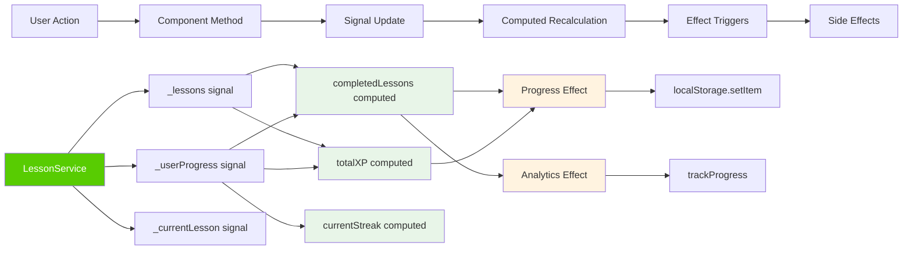

# Signals Data Flow

## Signals Architecture

```mermaid
graph LR
    A[User Action] --> B[Component Method]
    B --> C[Signal Update]
    C --> D[Computed Recalculation]
    D --> E[Effect Triggers]
    E --> F[Side Effects]
    
    G[LessonService] --> G1[_lessons signal]
    G --> G2[_userProgress signal]
    G --> G3[_currentLesson signal]
    
    G1 --> H1[completedLessons computed]
    G2 --> H1
    G1 --> H2[totalXP computed]
    G2 --> H2
    G2 --> H3[currentStreak computed]
    
    H1 --> I1[Progress Effect]
    H2 --> I1
    I1 --> J1[localStorage.setItem]
    
    H1 --> I2[Analytics Effect]
    I2 --> J2[trackProgress]
    
    style G fill:#58cc02,color:#fff
    style H1 fill:#e8f5e8
    style H2 fill:#e8f5e8
    style H3 fill:#e8f5e8
    style I1 fill:#fff3e0
    style I2 fill:#fff3e0
```

## Component Signal Usage

```mermaid
graph TD
    A[LessonsComponent] --> A1[lessonService.lessons]
    A --> A2[lessonService.completedLessons]
    A --> A3[lessonService.totalXP]
    A --> A4[lessonService.currentStreak]
    
    B[LessonDetailComponent] --> B1[id = input.required]
    B --> B2[currentQuestionIndex signal]
    B --> B3[selectedAnswer signal]
    B --> B4[currentLesson computed]
    B --> B5[currentQuestion computed]
    B --> B6[progressPercentage computed]
    
    C[ProfileComponent] --> C1[lessonService.completedLessons]
    C --> C2[lessonService.totalXP]
    C --> C3[lessonService.currentStreak]
    
    style A fill:#e3f2fd
    style B fill:#e8f5e8
    style C fill:#fce4ec
```